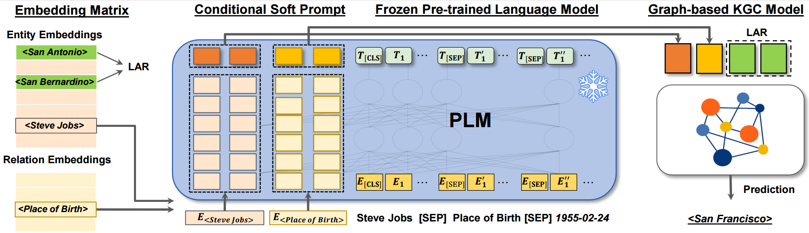

<h1 align="center">
  CSProm-KG
</h1>

<h4 align="center">Dipping PLMs Sauce: Bridging Structure and Text for Effective Knowledge Graph Completion via Conditional Soft Prompting</h4>

<h2 align="center">
  Overview of KG-S2S
  
</h2>
This repository includes the source code of the paper accepted by ACL 2023 Findings. 

[**"Dipping PLMs Sauce: Bridging Structure and Text for Effective Knowledge Graph Completion via Conditional Soft Prompting".**](https://arxiv.org/abs/2209.07299)

### Dependencies

- Compatible with PyTorch 1.11.0+cu113 and Python 3.x.
- Dependencies can be installed using `requirements.txt`.

### Dataset:

- We use WN18RR, FB15k-237, ICEWS14, ICEWS05-15 and Wikidata5m dataset for knowledge graph link prediction. 
- The preprocessed WN18RR, FB15k-237, ICEWS14 and ICEWS05-15 are included in the `./data/processed/` directory, except for Wikidata5m due to its large size. Processd Wikidata5m can be found [here](https://drive.google.com/drive/folders/11NnXlUVoE7cZsMum3VakwDhpPMdwMltR?usp=sharing). Alternatively, you can download the raw 
dataset into `./data/raw/` and run the corresponding scripts to generate the processed data. The raw data source are collected and can be downloaded [here](https://drive.google.com/drive/folders/11NnXlUVoE7cZsMum3VakwDhpPMdwMltR?usp=sharing).
- Raw data source:
  - [WN18RR](https://github.com/wangbo9719/StAR_KGC)
  - [FB15k-237](https://github.com/wangbo9719/StAR_KGC)
  - [ICEWS14](https://github.com/mniepert/mmkb), [Dataverse](https://dataverse.harvard.edu/dataset.xhtml?persistentId=doi:10.7910/DVN/28075)
  - [ICEWS05-15](https://github.com/mniepert/mmkb), [Dataverse](https://dataverse.harvard.edu/dataset.xhtml?persistentId=doi:10.7910/DVN/28075) (The additional data can be downloaded via the 'Access Dataset' button)
  - [Wikidata5m_transductive](https://www.dropbox.com/s/6sbhm0rwo4l73jq/wikidata5m_transductive.tar.gz?dl=1), [Wikidata5m_text](https://www.dropbox.com/s/7jp4ib8zo3i6m10/wikidata5m_text.txt.gz?dl=1), [Wikidata5m_alias](https://huggingface.co/datasets/intfloat/wikidata5m/resolve/main/wikidata5m_alias.tar.gz) (The contents of Wikidata5m_transductive and Wikidata5m_text need to be combined into single folder for preprocessing.)


### Pretrained Checkpoint:

To enable a quick evaluation, we upload the [trained model](https://drive.google.com/drive/u/3/folders/1d6BsoQSCV-HheKVYWShhFos-IHktGWTi). 
Download the checkpoint folders to `./checkpoint/`, and run the evaluation commandline for corresponding dataset.

The results are:

|  Dataset   |   MRR    |  H@1   |  H@3   |  H@10  | 
|:----------:|:--------:|:------:|:------:|:------:|
|   WN18RR   | 0.572660 | 52.06% | 59.00% | 67.79% | % 3618847
| FB15k-237  | 0.357701 | 26.90% | 39.07% | 53.55% | % 3589872	3593025
| Wikidata5m | 0.379789 | 34.32% | 39.91% | 44.57% | % 3592828	3973053
|  ICEWS14   | 0.627971 | 54.74% | 67.73% | 77.30% | % 3597939	3599830
| ICEWS05-15 | 0.626890 | 54.27% | 67.84% | 78.22% | % 3589499	3589499


### Training and testing:

- Install all the requirements from `./requirements.txt.`
- Commands for reproducing the reported results:
  ##### WN18RR
  ```shell
  python3 main.py -dataset WN18RR \
                  -batch_size 128 \
                  -pretrained_model bert-large-uncased \
                  -desc_max_length 40 \
                  -lr 5e-4 \
                  -prompt_length 10 \
                  -alpha 0.1 \
                  -n_lar 8 \
                  -label_smoothing 0.1 \
                  -embed_dim 144 \
                  -k_w 12 \
                  -k_h 12 \
                  -alpha_step 0.00001

  
  # evaluation commandline:
  python3 main.py -dataset WN18RR \
                  -batch_size 128 \
                  -pretrained_model bert-large-uncased \
                  -desc_max_length 40 \
                  -lr 5e-4 \
                  -prompt_length 10 \
                  -alpha 0.1 \
                  -n_lar 8 \
                  -label_smoothing 0.1 \
                  -embed_dim 144 \
                  -k_w 12 \
                  -k_h 12 \
                  -alpha_step 0.00001 \
                  -model_path path/to/trained/model
                  
  ```
  ##### FB15k-237
  ```shell
  python3 main.py -dataset FB15k-237 \
                  -batch_size 128 \
                  -pretrained_model bert-base-uncased \
                  -epoch 60 \
                  -desc_max_length 40 \
                  -lr 5e-4 \
                  -prompt_length 10 \
                  -alpha 0.1 \
                  -n_lar 8 \
                  -label_smoothing 0.1 \
                  -embed_dim 156 \
                  -k_w 12 \
                  -k_h 13 \
                  -alpha_step 0.00001 

  # evaluation commandline:
  python3 main.py -dataset FB15k-237 \
                  -batch_size 128 \
                  -pretrained_model bert-base-uncased \
                  -desc_max_length 40 \
                  -lr 5e-4 \
                  -prompt_length 10 \
                  -alpha 0.1 \
                  -n_lar 8 \
                  -label_smoothing 0.1 \
                  -embed_dim 156 \
                  -k_w 12 \
                  -k_h 13 \
                  -alpha_step 0.00001 \
                  -model_path path/to/trained/model
  ```
    ##### Wikidata5m
  ```shell
  python3 main.py -dataset wikidata5m_transductive \
                  -batch_size 450 \
                  -pretrained_model bert-base-uncased \
                  -epoch 20 \
                  -desc_max_length 40 \
                  -lr 1e-4 \
                  -prompt_length 5 \
                  -label_smoothing 0 \
                  -hid_drop 0.1 \
                  -hid_drop2 0.1 \
                  -feat_drop 0.1 \
                  -embed_dim 180 \
                  -k_w 10 \
                  -k_h 18 
  
  # evaluation commandline:
  python3 main.py -dataset wikidata5m_transductive \
                  -batch_size 450 \
                  -pretrained_model bert-base-uncased \
                  -desc_max_length 40 \
                  -lr 1e-4 \
                  -prompt_length 5 \
                  -label_smoothing 0 \
                  -hid_drop 0.1 \
                  -hid_drop2 0.1 \
                  -feat_drop 0.1 \
                  -embed_dim 180 \
                  -k_w 10 \
                  -k_h 18 \
                  -model_path path/to/trained/model
  ```
  ##### ICEWS14
  ```shell
  python3 main.py -dataset ICEWS14 \
                  -batch_size 384 \
                  -pretrained_model bert-base-uncased \
                  -epoch 300 \
                  -desc_max_length 40 \
                  -embed_dim 128 \
                  -lr 5e-4 \
                  -prompt_length 5 \
                  -alpha 0.1 \
                  -n_lar 8 \
                  -label_smoothing 0.1 \
                  -gamma 0 \
                  -embed_dim 144 \
                  -k_w 12 \
                  -k_h 12 

  
  # evaluation commandline:
  python3 main.py -dataset ICEWS14 \
                  -batch_size 384 \
                  -pretrained_model bert-base-uncased \
                  -desc_max_length 40 \
                  -embed_dim 128 \
                  -lr 5e-4 \
                  -prompt_length 5 \
                  -alpha 0.1 \
                  -n_lar 8 \
                  -label_smoothing 0.1 \
                  -gamma 0 \
                  -embed_dim 144 \
                  -k_w 12 \
                  -k_h 12 \
                  -model_path path/to/trained/model
  ```
  
  ##### ICEWS05-15
  ```shell
  python3 main.py -dataset ICEWS05-15 \
                  -batch_size 384 \
                  -pretrained_model bert-base-uncased \
                  -desc_max_length 40 \
                  -lr 1e-4 \
                  -prompt_length 5 \
                  -label_smoothing 0.1 \
                  -hid_drop 0.2 \
                  -hid_drop2 0.2 \
                  -feat_drop 0.2 \
                  -embed_dim 180 \
                  -k_w 10 \
                  -k_h 18


  
  # evaluation commandline:
  python3 main.py -dataset ICEWS05-15 \
                  -batch_size 384 \
                  -pretrained_model bert-base-uncased \
                  -desc_max_length 40 \
                  -lr 1e-4 \
                  -prompt_length 5 \
                  -label_smoothing 0.1 \
                  -hid_drop 0.2 \
                  -hid_drop2 0.2 \
                  -feat_drop 0.2 \
                  -embed_dim 180 \
                  -k_w 10 \
                  -k_h 18 \
                  -model_path path/to/trained/model
  ```


